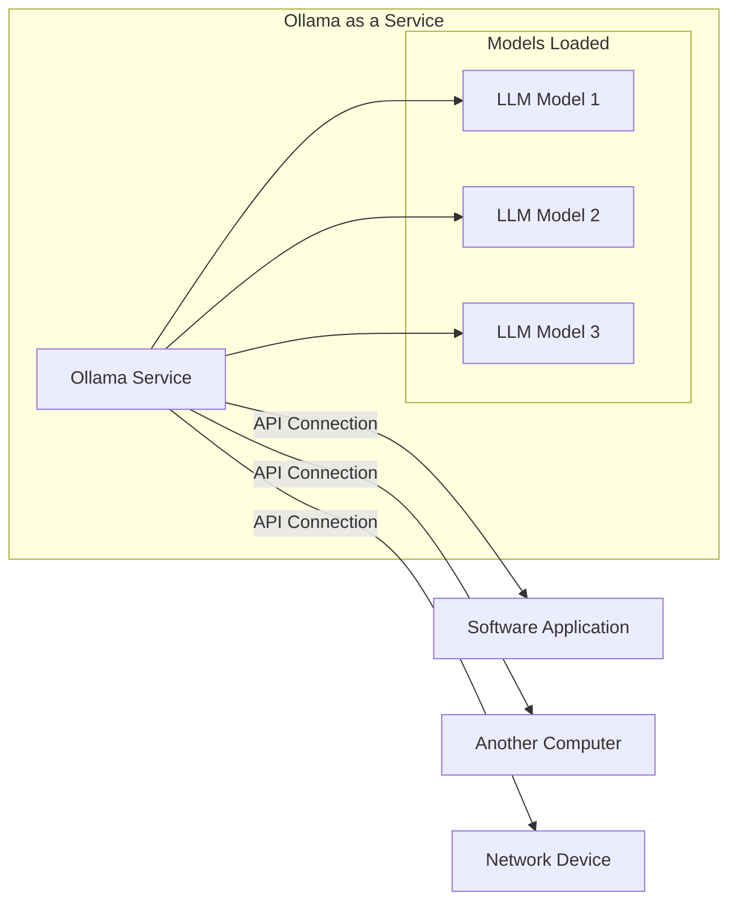

**Llama Models from Meta**

In this workshop, we will use the [**Llama**](https://www.llama.com) model developed by Meta (formerly Facebook). Llama models are a series of advanced Large Language Models (LLMs) designed to assist researchers and developers in various natural language processing tasks.

#### **What are Llama Models?**

- **Developed by Meta AI:** Llama (Large Language Model Meta AI) models are cutting-edge LLMs created by Meta's AI research division.
- **Purpose:** Designed to advance the field of AI by providing powerful language models to the research community.
- **Model Sizes:** Llama models come in various sizes, including 7B, 13B, 33B, and 65B parameters, catering to different computational capacities.

#### **Why are Llama Models Considered Open Models?**

- **Open Access for Research:** Meta has made Llama models available to the research community under a non-commercial license, allowing researchers to study and build upon the models.
- **Transparency:** By releasing the models and their architectures, Meta promotes transparency and collaboration in AI research.
- **Community Contributions:** The openness encourages improvements and adaptations by the community.

#### **Using Llama 3.2 Model**

In this workshop, we will be using the **Llama 3.2** model:

- **Recent and Improved:** Llama 3.2 is the latest version released by Meta, featuring enhancements over the original Llama models.
- **Smaller Size:** Available in smaller parameter sizes like 1B, making it suitable for environments with limited computational resources.
- **Performance:** Despite its smaller size, Llama 3.2 offers impressive performance on various language tasks.

## Ollama and Running llama Locally

This workshop mainly uses [**Ollama**](https://ollama.com), a tool designed to run LLMs locally. In this workshop, we will use Ollama to run LLM models on our machines, leveraging its simplicity and efficiency.

### What is Ollama?

Ollama is an open-source platform that enables users to run LLMs on their local devices without the need for complex setups or extensive computational resources. It is recognized for being one of the most straightforward and popular systems for running LLMs locally.

### Why Use Ollama?

- **Simplicity:** Ollama is designed to be user-friendly, requiring no complicated configurations or dependencies like Docker. It works straight out of the box, making it accessible even to those with minimal technical expertise.

- **Easy Model Management:** Installing and updating models in Ollama is a straightforward process. Users can quickly download models and get them running without hassle.

- **Performance Efficiency:** Ollama is optimized for speed and resource efficiency. It runs models relatively faster while consuming less memory, making it suitable for environments with limited computing capacity.

### Running Ollama as an Independent Service

One of the standout features of Ollama is its ability to run as an independent service. This means:

- **Network Accessibility:** Other applications or computers on the same network can connect to the Ollama instance. This is particularly beneficial in work or home environments where resources are shared.

- **Resource Sharing:** By installing Ollama on a high-power server or computer, multiple users and services can access the LLM capabilities without each needing a powerful machine.

- **API Integration:** Ollama exposes its services through an API, allowing seamless integration with various software systems, scripts, and services. This makes accessing LLM features across the network straightforward and efficient.

- **Open Source and Community Support:** Ollama is 100% open-source, encouraging collaboration and adoption. Many other open-source projects have adopted Ollama as their backend, contributing to its popularity and continuous improvement.

### Comparison with Other Alternatives

While there are several alternatives for running LLMs locally, Ollama stands out due to:

- **Ease of Use:** No need for complex setups like Docker; it offers a simple installation and setup process.

- **Performance:** Optimized for speed and efficiency, making it suitable for various hardware configurations, and runs completely offline.

- **Community and Support:** Being open-source, it benefits from community contributions and widespread adoption.

*In this workshop, we will explore how to install, configure, and utilize Ollama to run LLMs locally, taking advantage of its features to enhance our applications and services.*

## Installing and running Ollama

Install Ollama by following the instructions provided in the [Ollama documentation](https://ollama.com/download).

Once installed, you can run Ollama by executing the appropriate command in your terminal or command prompt. This will start the Ollama service.

If the service is rulling properly, you can test the Ollama apu through your web browser by visiting `http://localhost:11434/`.  It should respond `Ollama is running`

Some details about installing and running Ollama is available in the [Ollama Github reop](https://github.com/ollama/ollama/tree/main/docs).
